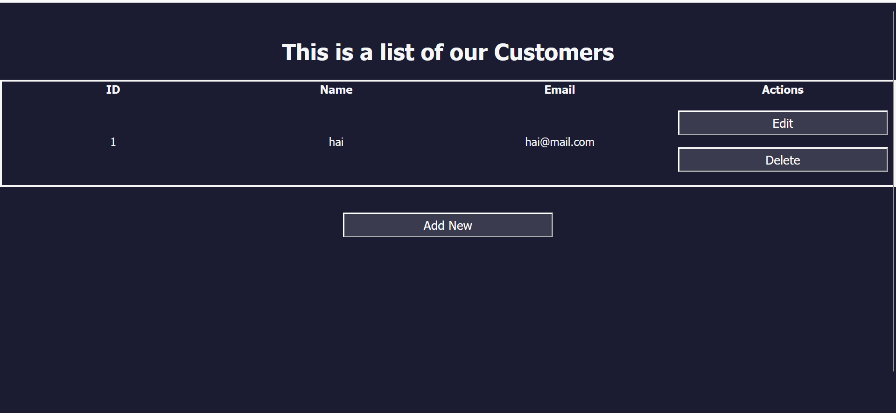

# This is a simple Login-Register Web

## Introduction

This is a simple website to store information. You can Add value, Edit, and Delete it. Bear in mind that the table that I created is not using Regex yet. You can to homepage by using this account.
```
email : user@mail.com
password : Password123
```

## What features did I used?

- JS Regex
- JS DOM
- Local Storage
- CRUD

## Live Preview

https://profound-cheesecake-885489.netlify.app/

## Screenshot




